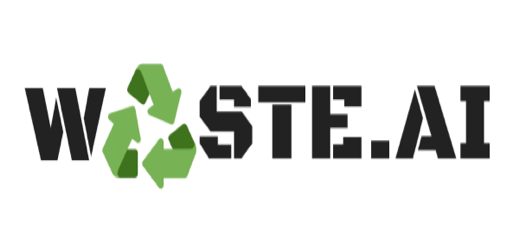

# waste-classifier

- Waste AI is a Python algorithm for building computer vision models on recyclable, hazardous, and problematic waste imagery sets. More specifically, we focus on ten types of waste: Roofing, Organics, Concrete, Bricks, Other, Wood, Plastic, Gypsum, Metal



## Why are we doing this?

- Nearly half of all waste in America is produced by construction and demolition (300 million tons annually)
- Facilities that handle this waste must analyze this by hand for waste management planning
- This is very costly (and potentially hazardous) to manually classify waste

## The Goal

- Create a software system that can analyze and categorize the source of construction and demolition waste for data collection purposes
- For example, determining if waste came from a roof deconstruction job or a carpet removal job

### Prerequisites

Python Dependencies

```
conda install pandas tensorflow numpy keras matplotlib scipy ipywidgets seaborn opencv
```

End with an example of getting some data out of the system or using it for a little demo

## Authors

- **Jason Chen** - _Initial work_ - (https://github.com/lechn)

See also the list of [contributors](https://github.com/LeChn/waste-classifier/contributors) who participated in this project.

## License

This project is licensed under the MIT License - see the [LICENSE.md](LICENSE.md) file for details

## Acknowledgments

- Hat tip to anyone whose code was used
- Inspiration
- etc
